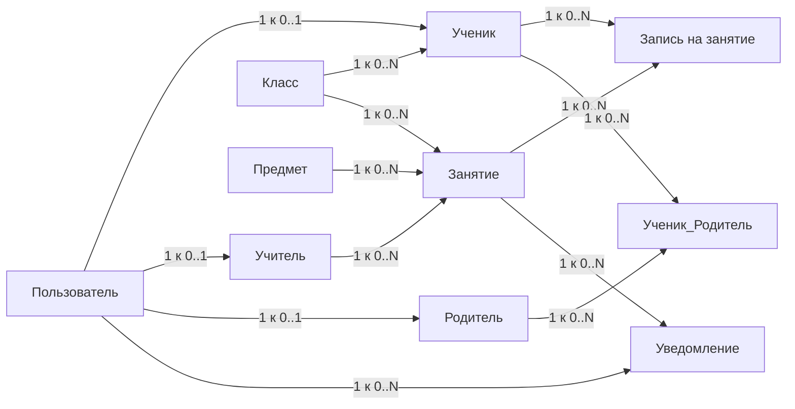

# ER-модель School Activities Hub

## Основные сущности MVP

### 1. Пользователь

Хранит общие данные всех пользователей системы.

**Атрибуты:**

* id пользователя
* ФИО
* email
* телефон
* пароль
* роль
* статус аккаунта
* дата создания

**Роли:**

* ученик
* учитель
* родитель
* администратор

---

### 2. Класс

Нужен, чтобы привязывать учеников и занятия к конкретной параллели/классу.

**Атрибуты:**

* id класса
* номер класса
* буква класса
* учебный год

Пример: `9Б`, `2025/2026`.

---

### 3. Ученик

Расширение пользователя с ролью «ученик».

**Атрибуты:**

* id ученика
* id пользователя
* id класса

---

### 4. Учитель

Расширение пользователя с ролью «учитель».

**Атрибуты:**

* id учителя
* id пользователя
* предмет / специализация

---

### 5. Родитель

Расширение пользователя с ролью «родитель».

**Атрибуты:**

* id родителя
* id пользователя

---

### 6. Ученик — Родитель

Связующая таблица, потому что:

* у ученика может быть несколько родителей;
* у родителя может быть несколько детей.

**Атрибуты:**

* id связи
* id ученика
* id родителя
* тип связи

Пример: мама, папа, законный представитель.

---

### 7. Предмет

Справочник предметов.

**Атрибуты:**

* id предмета
* название предмета

Пример: английский язык, математика, русский язык.

---

### 8. Занятие

Главная сущность проекта.

**Атрибуты:**

* id занятия
* id учителя
* id предмета
* id класса
* название
* описание
* дата
* время начала
* время окончания
* лимит участников
* статус занятия
* дата создания

**Статусы:**

* опубликовано
* отменено
* завершено
* черновик

---

### 9. Запись на занятие

Фиксирует факт записи ученика на занятие.

**Атрибуты:**

* id записи
* id занятия
* id ученика
* статус записи
* дата записи
* дата отмены

**Статусы:**

* активна
* отменена
* посещено
* не посещено

---

### 10. Уведомление

Хранит уведомления, которые система отправляет пользователям.

**Атрибуты:**

* id уведомления
* id пользователя
* id занятия
* тип уведомления
* текст
* статус отправки
* дата создания
* дата отправки

**Типы:**

* запись подтверждена
* занятие изменено
* занятие отменено

---

# Mermaid-представление связей

---
