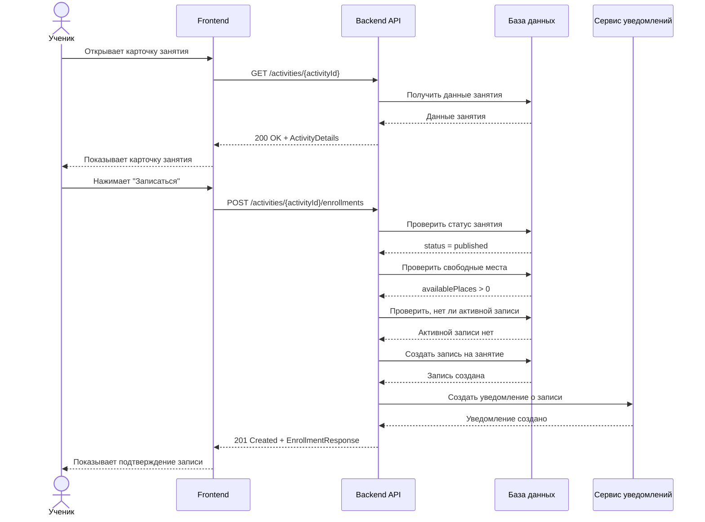
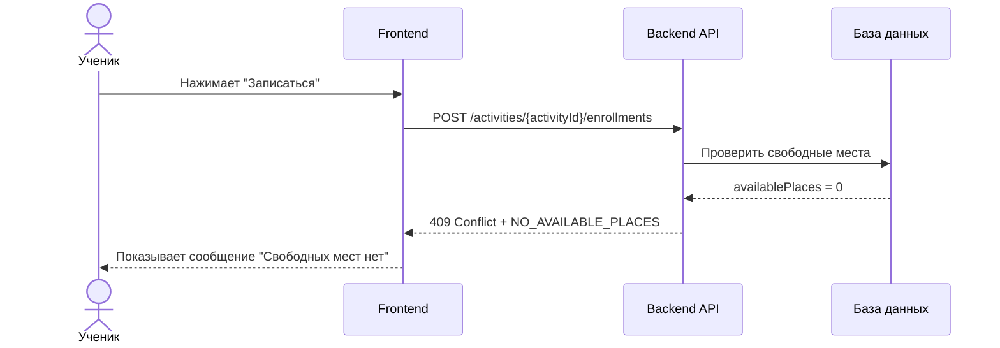
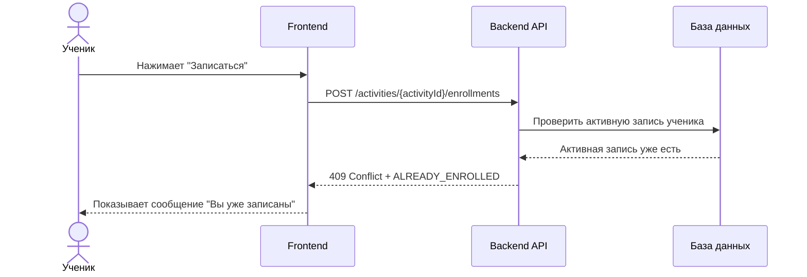

# Sequence Diagram

## Сценарий: запись ученика на занятие

Участники:

* Ученик
* Frontend
* Backend API
* База данных
* Сервис уведомлений

## Альтернативные сценарии

### Нет свободных мест

### Ученик уже записан

## Важное пояснение

На диаграмме видно, что перед созданием записи система проверяет три бизнес-условия:

1. занятие опубликовано;
2. есть свободные места;
3. ученик ещё не записан на это занятие.

Это связывает Sequence Diagram с бизнес-правилами API и ER-моделью.

---
